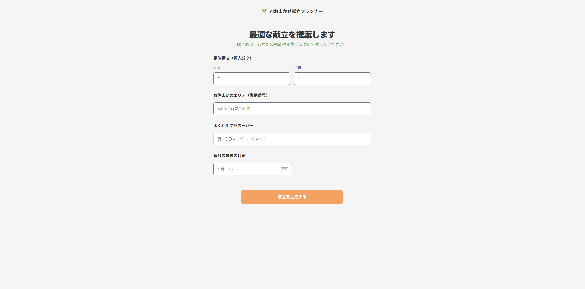
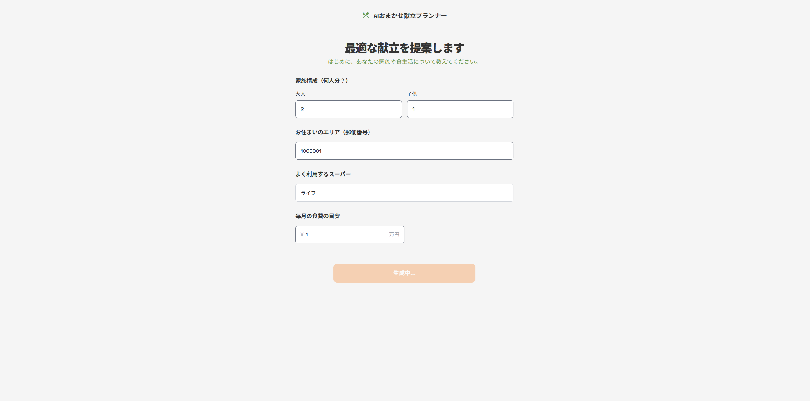
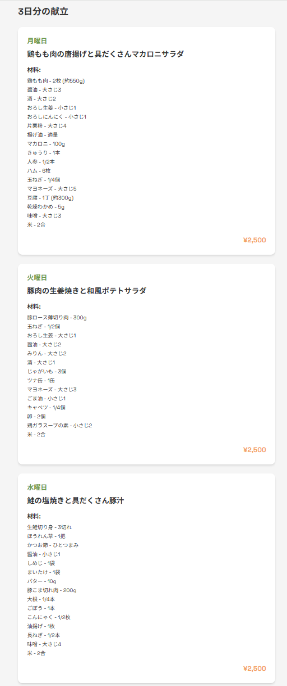
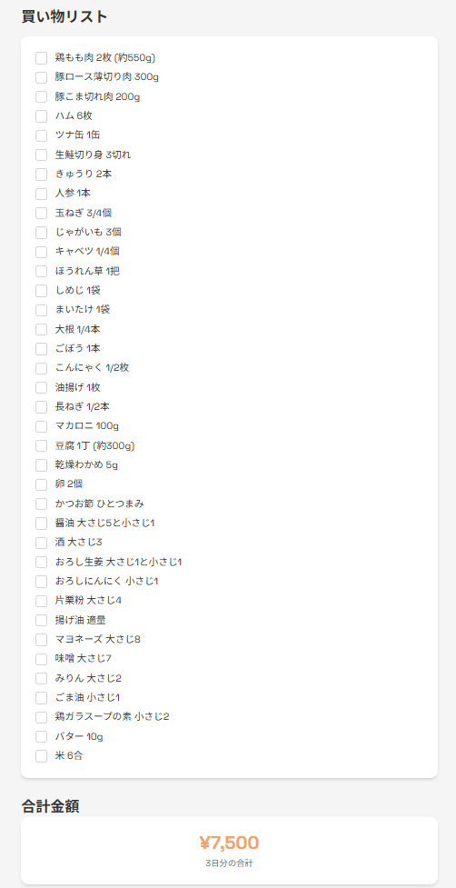

# AIおまかせ献立プランナー

## 概要

家族構成と予算を入力するだけで、Gemini AIが3日分の献立と買い物リストを自動生成するWebアプリケーション。
献立を考える手間を省き、予算内で効率的な食材購入をサポートします。

## デモ

- 入力画面
  
- 献立生成ボタン押下後
  
- 献立カード
  
- 買い物リスト+合計金額
  

※デプロイURL: 準備中

## 使用技術

- **フロントエンド**: React 19, TypeScript, Vite, Tailwind CSS
- **バックエンド**: Java 17, Spring Boot 3.5.7, Gemini API
- **開発ツール**: Git, GitHub, PowerShell

## 機能一覧

- 家族構成（大人・子供）と予算に基づく献立自動生成
- 地域（郵便番号）とスーパー名を考慮した価格設定
- 3日分の献立表示（材料・分量・費用）
- チェックボックス付き買い物リスト
- 合計金額の自動計算
- 入力値のリアルタイムバリデーション

## セットアップ方法

### 必要な環境

- Java 17以上
- Node.js 18以上
- Gemini API キー（[Google AI Studio](https://aistudio.google.com/)で取得）

### 起動手順

#### 1. リポジトリをクローン

```bash
# バックエンド（別リポジトリ）
git clone https://github.com/Yuta600/kondate-ai-backend.git
cd kondate-ai-backend

# フロントエンド（このリポジトリ）
git clone https://github.com/Yuta600/kondate-ai-frontend.git
cd kondate-ai-frontend
```

#### 2. バックエンド起動

```bash
cd kondate-ai-backend

# application-local.properties を作成
# src/main/resources/application-local.properties
# 内容:
# gemini.api.key=YOUR_API_KEY
# gemini.api.url=https://generativelanguage.googleapis.com/v1beta/models/gemini-2.5-flash:generateContent

# 起動
./gradlew bootRun
```

#### 3. フロントエンド起動

```bash
cd kondate-ai-frontend
npm install
npm run dev
```

http://localhost:5173 でアクセス

## 工夫した点

### アーキテクチャ設計

- **AI切り替え可能な設計**: インターフェースを使用し、DummyとGeminiの実装を切り替え可能にすることで、開発効率とテスト容易性を向上

### ユーザー体験

- **買い物リストの統合表示**: 3日分の材料を重複なく統合し、一度の買い物で済むように最適化
- **直感的なUI**: チェックボックスで買ったものに取り消し線を表示し、買い忘れを防止
- **複数エラーの同時表示**: 入力エラーをすべて一度に表示し、修正作業を効率化

### コード品質

### コード品質

- **適切なコンポーネント分割**: 責任ごとに部品化（InputForm, MenuCard, ShoppingList など）し、可読性と再利用性を向上
- **型安全な実装**: 学習のためフォームライブラリを使わず、useState と TypeScript の型システム（Partial, Record）で状態管理を実装（今後ライブラリで実装予定）

## 今後の展望

- ユーザー認証機能の実装
- 献立履歴の保存・閲覧機能
- お気に入り献立の登録
- 郵便番号からの住所自動入力
- レシピURLの自動取得
- アレルギー・嫌いな食材の除外機能

## 開発期間

約2週間（2025年10月下旬～）

## 関連リポジトリ

- バックエンド: https://github.com/Yuta600/kondate-ai-backend
- フロントエンド: https://github.com/Yuta600/kondate-ai-frontend
